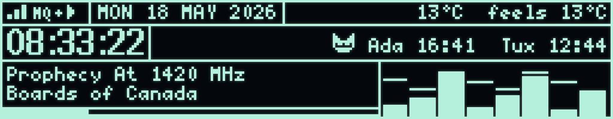
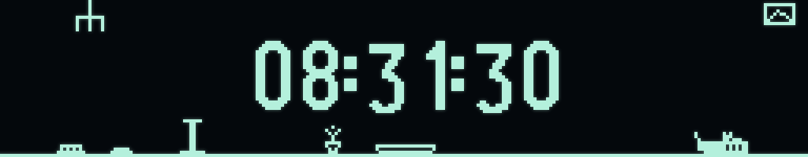
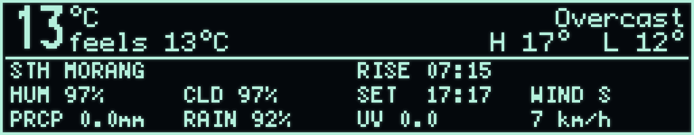
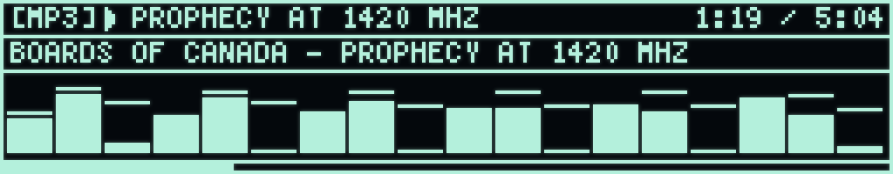
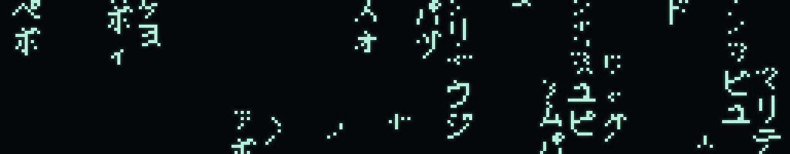
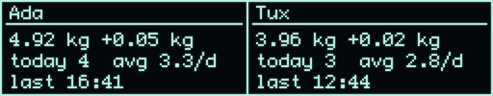
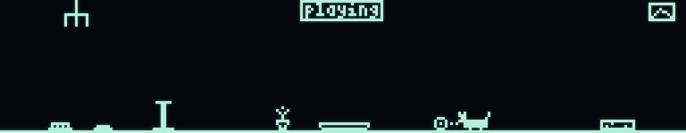
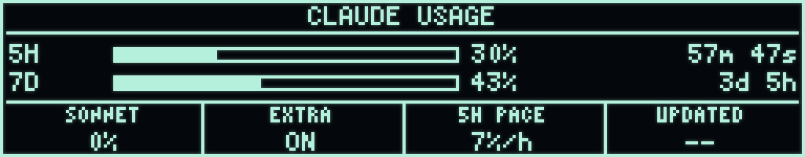
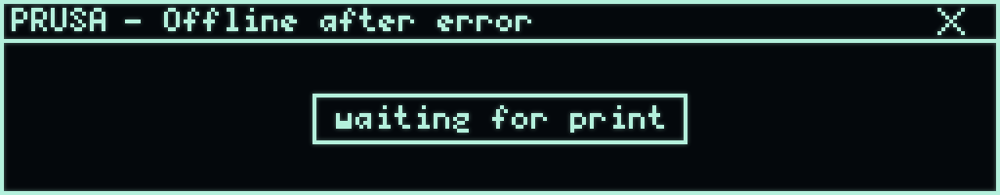
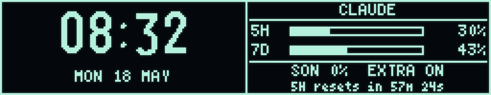

# VFD Desk HUD


A desk dashboard built around a 256×50 GP1287BI VFD panel driven by a Raspberry Pi Pico W. It cycles through eleven pages of live info — clock, weather, now-playing with visualizers, OctoPrint print progress, Claude API usage, cat-scale telemetry, and a Portal/Aperture easter egg — pulled from MQTT and a handful of REST endpoints.

Full writeup with photos: **[Building a VFD Desk HUD](https://dmello.io/building-a-vfd-desk-hud-with-a-pi-pico-w/)**.

## Features

- **11 pages** (see gallery below), each navigable by rotary knob, MQTT, or serial
- ~20 fps render loop with independent network/MQTT refresh
- **OTA firmware updates** with a terminal-style `> FLASHING` splash rendered directly from the OTA callbacks
- **Wireless screenshot endpoint** at `http://vfd-dashboard.local/screenshot.bmp` — every image in this README was grabbed that way
- **Home Assistant integration** — `display on/off` from a presence sensor and `lux N` from an ambient-light sensor (mapped through a built-in brightness curve)
- **Two-way MQTT state**: device publishes its current state (page, brightness, display on/off, Claude data, uptime, IP, …) as retained JSON on `vfd/state`, plus an `online` / `offline` availability topic via MQTT LWT
- **LittleFS-cached state** for cats, Claude usage, and last-print timestamp so reboots show known values instantly — no "waiting for…" beat
- Configurable fonts, clock animations, music visualizers, and a "dash glitch" toggle for fun

## Pages

> All screenshots are pulled live from the device over the HTTP endpoint and recoloured with the VFD's blue-green glow for legibility on the web. Pixels and layout are 1:1 with the actual display (256×50, upscaled 4×).

### 0 · Overview



The default dash. Status bar, big clock, current song with progress bar, weather summary on the right, plus a rotating stat slot that cycles through cat weights / visits, Claude 5h-7d budgets, the device's IP, and (when active) the Prusa print progress.

### 1 · Time



Full-screen clock with selectable face animations and numeral fonts. Press the knob to cycle through clock faces.

### 2 · Weather



Big current temp, feels-like, hi/lo, plus a 4-column grid of humidity, cloud cover, sunrise/sunset, wind direction & speed, precipitation, and UV — pulled from Open-Meteo.

### 3 · Now Playing



Twin-rule head-unit frame around a scrolling track + artist, elapsed/total time, and a configurable audio visualizer driven by the song's progress. Spotify metadata comes in over MQTT.

### 4 · Matrix Rain



Katakana raindrops. Press the knob here and up/down rotate brightness while a progress bar shows the current level. 15-second timeout returns the knob to page-cycling.

### 5 · Cats



Telemetry for Ada and Tux from a custom cat-scale rig — weight, today's visits, average per day, and last seen.

### 6 · Tamagotchi



A little cat lives on a floor with some furniture, picks weighted-random activities (nap, eat, scratch, play, hairball, chandelier-swinging, …), walks to the right spot, and does the thing.

### 7 · Claude



Bars for the 5-hour and 7-day API budgets with countdown to reset, plus a four-cell stats strip — current Sonnet %, extra-usage flag, hourly burn rate ("5H pace"), and time since the last MQTT push.

### 8 · Portal


Aperture Laboratories logo splash on entry, then a typewriter scroll of Portal-flavoured log lines with occasional band-shift glitches and pixel noise.

### 9 · Prusa



OctoPrint job + temperatures via REST. Header with state and a live throbber, thin full-width progress bar, then three columns (time / filament / temps) under a divider. Falls back to a centred "waiting for print" tooltip after 30 min of idle, persisted across reboots.

### 10 · Watch



My default work page — chunky `logisoso22` clock + date on the left, compact Claude usage on the right (5h + 7d bars, Sonnet %, extra-usage flag, countdown to the next reset).

## Hardware

EEI **EPC-INBN0BV1287UD** carrier (GP1287BI 256×50 VFD) driven from a **Raspberry Pi Pico W** via software SPI.

### Wiring

| Carrier (CN7) | Pico W | Notes                                      |
| ------------- | ------ | ------------------------------------------ |
| FILMENT_EN    | GP2    | Active-HIGH (10kΩ internal pull-down)      |
| CLOCK         | GP9    | Not a hardware SCK pin — software SPI only |
| CHIPSELECT    | GP8    | Active-LOW                                 |
| DATA          | GP7    |                                            |
| RESET         | GP6    | Active-LOW                                 |
| GND           | GND    | **Must** be bonded for signals to work     |

Power the carrier separately via USB-C or DC005 at 4.5–20 V, ≥ 2 A — the VFD can draw ~1.5 A at full brightness. Optionally feed the Pico's `VBUS` from the carrier's `+5V OUT` (CN6 pin 8) so one supply powers both.

> **Warning:** the carrier's on-board boost converter generates VHG = 60 V and VHP = 90 V to drive the VFD anode. Don't poke exposed pins while powered.

## Software

PlatformIO + arduino-pico (Earle Philhower core), u8g2 for rendering, ArduinoJson for parsing, PubSubClient for MQTT.

### Why a custom u8g2 fork

Three gotchas combined:

1. **GP1287BI is not in upstream u8g2.** The vendor fork in `lib/U8g2/` adds a GP1287AI driver; AI and BI share a command set, so the AI driver works for the BI.
2. **LSB-first 8-bit SPI.** u8g2's stock *software* SPI byte drivers are hardcoded MSB-first — only the *hardware* SPI path respects LSB-first. A ~15-line custom byte callback handles it.
3. **GP9 is not a valid RP2040 SCK pin**, so hardware SPI is off the table without rewiring.

### Build & flash

USB (first time, or recovery):

```sh
pio run -e pico_w -t upload
```

Over the air, once the device is on the network and running firmware with `ArduinoOTA`:

```sh
pio run -e pico_w_ota -t upload
```

The OTA password lives in `src/net.cpp` (`OTA_PASSWORD`) and `platformio.ini` (`--auth=...`); change both to suit.

### Screenshots

The firmware serves a 1-bit BMP of the current framebuffer at `http://vfd-dashboard.local/screenshot.bmp`. Save it directly in a browser, or grab a series from the CLI:

```sh
curl -o page.bmp http://vfd-dashboard.local/screenshot.bmp
sips -s format png page.bmp --out page.png        # macOS built-in
# or: magick page.bmp -filter point -resize 400% page@4x.png
```

## MQTT interface

The device subscribes to `vfd/input` for plain-text commands. A few highlights:

| Command                       | Effect                                                  |
| ----------------------------- | ------------------------------------------------------- |
| `next` / `prev`               | Cycle page                                              |
| `page N`                      | Jump directly to page N (0..10)                         |
| `bright N`                    | Brightness 0..255 (persisted to flash)                  |
| `lux N`                       | Raw lux from an ambient-light sensor (auto-brightness)  |
| `display on` / `off` / blank  | Power the screen (presence sensor integration)          |
| `12h` / `24h`                 | Clock format                                            |
| `fnext` / `cnext` / `vnext`   | Cycle font / clock face / music visualizer              |
| `cat <name>`                  | Trigger an action on the tamagotchi page                |
| `glitch on/off/toggle`        | Dash-glitch overlay                                     |

Publishes:

- **`vfd/state`** — retained JSON snapshot of current state. Republished on any state change and at most every 30 s. Fields include `display`, `brightness`, `page` + `page_name`, `font`, `viz`, `clock_face`, `use_12h`, `ip`, `uptime_s`, and `reason` (what triggered the publish).
- **`vfd/availability`** — `online` on connect, `offline` via MQTT LWT when the broker loses contact.

Other topics the device listens on: `straybot/playing` (now-playing JSON), `claude/usage` (Claude API budget JSON), `keyboard/knob` (rotary knob events).


## Credits

- Custom u8g2 fork from the carrier vendor (EEI).
- Full project writeup, more photos, and the Mac menu-bar app that pushes Claude usage to MQTT: **<https://dmello.io/building-a-vfd-desk-hud-with-a-pi-pico-w/>**
